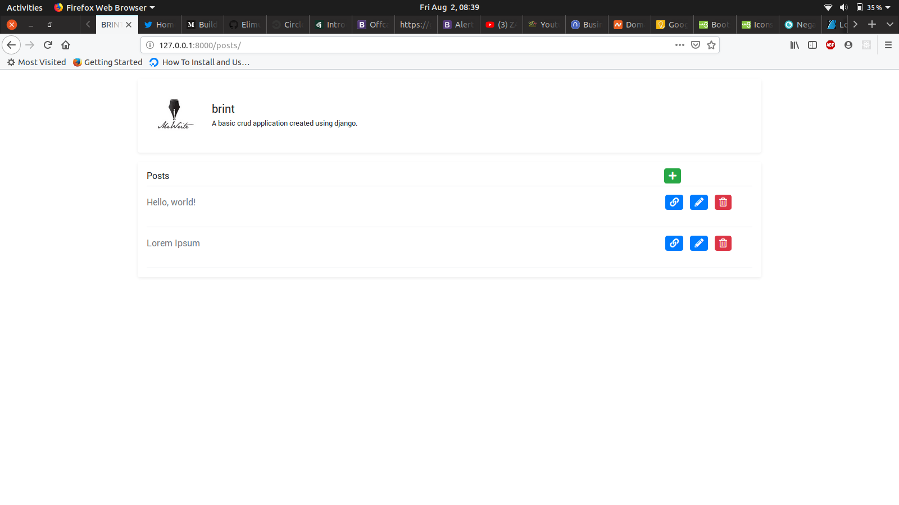

# brint
A simple crub application 
I'm following this article <a target="_blank">https://medium.com/@john.bagiliko/build-a-django-crud-web-application-part-ii-4dbce965ce1d</a>

I created all my views usning GCBV(Generic Class Based Views). This part of the documentation has all the details <a target="_blank">https://docs.djangoproject.com/en/2.2/ref/class-based-views/generic-editing/</a>
